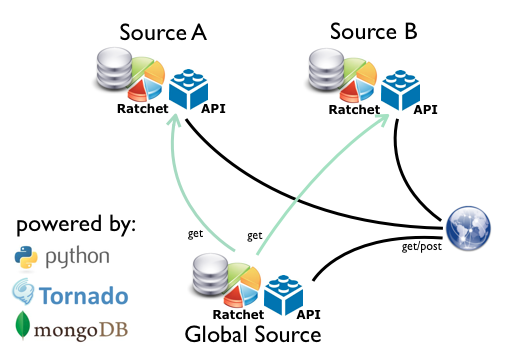

============
Architecture
============

Overview
========

Description
===========

**Source A and Source B**

Any instance that have their on statistics context. They could be identified as "local sources"

**Global Source**

An instance responsible to harvest the statistics from the "local sources" and create a Global accesses cosolidating accesses from more than one "local source" into on centralized database.